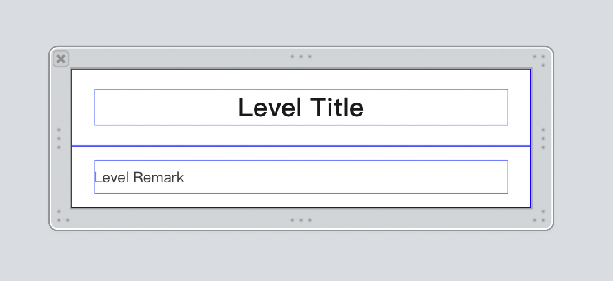

## UITableViewCell使用Autolayout控制台打印的一些系统警告处理

##### cell样式



##### 警告：
```
2020-07-22 11:56:04.757337+0800 优志愿[31484:747845] [LayoutConstraints] Unable to simultaneously satisfy constraints.
	Probably at least one of the constraints in the following list is one you don't want. 
	Try this: 
		(1) look at each constraint and try to figure out which you don't expect; 
		(2) find the code that added the unwanted constraint or constraints and fix it. 
(
    "<NSLayoutConstraint:0x600000294fa0 V:[UILabel:0x7fb9c98d7bd0'Level Remark']-(10)-|   (active, names: '|':UIView:0x7fb9c98d7890 )>",
    "<NSLayoutConstraint:0x600000295a40 V:|-(10)-[UILabel:0x7fb9c98d7bd0'Level Remark']   (active, names: '|':UIView:0x7fb9c98d7890 )>",
    "<NSLayoutConstraint:0x600000295e50 'UISV-hiding' UIView:0x7fb9c98d7890.height == 0   (active)>"
)
Will attempt to recover by breaking constraint 
<NSLayoutConstraint:0x600000294fa0 V:[UILabel:0x7fb9c98d7bd0'Level Remark']-(10)-|   (active, names: '|':UIView:0x7fb9c98d7890 )>
```

##### 问题原因
1. `Level Remark `label控件的`top`、`bottom`分别为10
2. 当`Level Remark `label所在的view隐藏时，view的高度应该为0，但是view的实际高度为20(`top` + `bottom`)，所以才会报错。

##### 解决方法

**将`top`、`bottom`的优先级调整为`750`**在隐藏view时，view的高度就是0了
